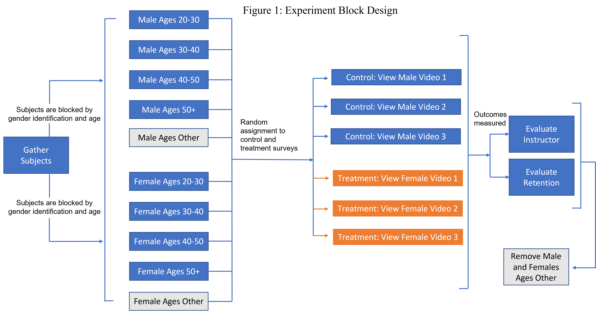

\clearpage

```{r setup, include=FALSE}
knitr::opts_chunk$set(fig.pos = 'H')
knitr::opts_chunk$set(echo = TRUE)
# prevent floating objects

library(data.table)
library(magrittr)
library(ggplot2)
library(sandwich)
library(lmtest)
library(stargazer)
library(stringr)
library(tidyverse)
library(gtsummary)
library(vtable)
library(cobalt)
library(qwraps2)
#library(xtables)
library(writexl)
library(webshot)

theme_set(theme_minimal())
options(tinytex.verbose = TRUE)
options(warn=-1)
```

```{r robustse, include=FALSE, echo=FALSE}
get_robust_se <- function(model) { 
    require(sandwich)
    
    sqrt(diag(sandwich::vcovHC(model)))
  }
```
```{r bonforonni_correction, include=FALSE, echo=FALSE}
get_p_correction <- function(model) { 
    require(sandwich)
    summary(model)$coefficients[,4]*5
}
```

## Background

Females in academia historically faced challenges due to gender stereotypes negatively impacting their earning potential and career growth. The United Nations Data Center’s Gender Social Norms Index (GSNI) cites educational bias against women as one of the most prevalent sources of gender inequality [1]. 

Specifically for women in academia, studies have demonstrated that students treat and evaluate male and female professors differently. In 2008, a study investigated the association between gender and student evaluations of teachers (SETs). A male and female professor each taught five sections of an identical online political science course. An end-of-semester survey showed that the female professor received lower teaching evaluation scores than her male counterpart. Additionally, the female instructor was evaluated differently from the male colleague on factors such personality and competence [3].

Female professors are oftentimes held to higher standards and subjected to a greater number of demands and requests from their students [2]. A 2014 study evaluated student ratings of online professors based on perceived gender of the professor [4]. A male and female assistant professor taught two discussion sections each for the same course. However, both instructors used a male identity for one discussion section and a female identity for the other. The study found that those perceived to be female generally received worse ratings regardless of actual gender, even though the male instructor received lower overall scores [5].

In the following experiment, we seek to extend on existing literature by looking at gender bias in a technical, non-academic setting such as computer programming. Specifically, we assess the quality of instruction and content retention of Python, an interpreted programming language, as taught by male and female instructors.


## Hypothesis & Research Questions

We hypothesized that the treatment of changing perceived gender of the instructor would impact the measured instructor ratings from students. This premise is based on historical evidence of gender bias in academia favoring men’s performance, grant and award-winning potential, resource allocation, and tenure. These factors continue to reinforce gender wage gaps and lead to better career outcomes for men [1, 5]. Based on our hypothesis we formulated the following primary and secondary research questions:

* Primary Research Question: *Does an instructor’s perceived gender influence the perceived quality of instruction?*

* Secondary Research Question: *Does an instructor’s perceived gender influence retention of content?*

We specifically expected our primary and secondary outcome measures to decrease when exposing subjects to the treatment group of instructors they perceived as female, indicating lower perceived quality of instruction and lower content retention stemming from negative views of women in academia.


```{r powertest, include=FALSE}
pwr <- data.table()

# we expect to have 56 subjects in the treatments and control groups
pwr[ , condition := rep(c('control', 'treatment'), each = 56)]

#Based on Gender Bias in Student Evaluations Study by Kristina Mitchell and Johnathan Martin outcome variable was 5-point likhert scale
male_instructor = mean(3.84, 3.71, 3.71, 3.83, 3.96)
female_instructor = mean(3.44, 3.31, 3.49, 3.64, 3.97)

pwr[condition == 'control', Y := rnorm(.N, mean = female_instructor, sd = .65)]
pwr[condition == 'treatment', Y := rnorm(.N, mean = male_instructor, sd = .5)]

#p[ , t.test(Y ~ condition)]

power_test_t <- function(
                          mean_control = female_instructor,
                          mean_treat = male_instructor,
                          sd_control = .5,
                          sd_treat = .65,
                          number_per_condition = 56,
                          power_loops = 100,
                          ri_loops = 100,
                          verbose = TRUE) {
                          p_values <- NA
                          ri <- NA
                          pwr <- data.table()
                          1
                          pwr[ , condition := rep(c('control', 'treatment'), each = number_per_condition)]
                          for(power_loop in 1:power_loops) {
                          p_values[power_loop] <- t.test(
                          x = rnorm(number_per_condition, mean = mean_control, sd = sd_control),
                          y = rnorm(number_per_condition, mean = mean_treat, sd = sd_treat)
                          )$p.value
                          }
                          return(list(
                          'p_values' = p_values,
                          'power' = mean(p_values < 0.05)
                          ))
}

power = power_test_t(power_loops = 100)$power
```
## Data

To conduct the experiment, we explored subject recruiting companies in order to obtain a more generalizable pool of survey participants. The requirements outlined for recruiting companies included the ability to:

* Administer Qualtrics survey to subjects
* Record subject responses
* Ensure sufficient sample size according to our power analysis (see Statistical Analysis Approach)
* Enable blocked design
* Include inclusion and exclusion criteria
* Disqualify those who failed the attention check
* Deliver responses to us in a timely manner
* Within $500 budget limit

The social science recruitment company we chose to work with, SurveySwap, was the best fit based on the criteria above. SurveySwap was used to identify subjects, deliver control and treatment surveys, and deliver subject responses.


## Experiment Design

Our experiment featured a randomized, between-subjects design with a 2x4 blocked design on the gender and age groups of participants so as to ensure equal treatment distributions among each of the blocked populations. The sample design consisted of 112 participants equally split between self-identified male (n = 56) and self-identified female (n = 56) survey participants.

The control group consisted of subjects who viewed a Python instructional video voiced using a male voiceover. The treatment group consisted of subjects who watched the exact same video voiced using a female instead of male voiceover. To further mitigate potential instructor-level attributes that may influence instructor evaluations, subjects in the treatment and control groups were randomly assigned to one of three possible instructors. Specifically, there were six different recordings of the same video with the same script in the experiment: three different male recordings within the control group, and three different female recordings in the treatment group. 

Subjects were sorted into blocks (Figure 1 below) and then randomized into surveys utilizing Qualtrics’s survey logic functions. The ***primary outcome*** variables were: 

* __Enthusiasm__: rating of the instructor’s enthusiasm
* __Knowledge__: rating of the instructor’s knowledge
* __Clarity__: rating on how clearly respondents felt the instructor explained the material
* __Professionalism__: evaluating the instructor’s professionalism
* __Overall Effectiveness__: rating of the overall effectiveness of the instructor’s teaching 

Primary outcome variable questions were administered as questions using a 5-point Likert scale. A ***secondary outcome*** variable was **quiz score** measured on the correctness of answers to several content retention questions. The inclusion and exclusion criteria requirements detailed below were stipulated to allow researchers to capture treatment effects for adults in the United States. 

**Inclusion criteria:** To qualify for the survey, subjects must be located in the United States and identify as a native English speaker. 

**Exclusion criteria:** Subjects less than 20 years of age were excluded from the study.


```{r experimental design, echo=FALSE, out.height="90%", out.width="90%", fig.align="center"}

```

## Statistical Power

Prior to conducting the experiment, a statistical power test was completed to evaluate whether a sample size of at least 112 participants, evenly split between treatment and control, would be sufficient to observe the treatment effect. It was estimated from the average outcome from the Gender Bias in Student Evaluations study by Kristina Mitchell and Johnathan Martin [3]. The test showed `r round(power*100,0)`% of all potential random assignments would effectively reject the null hypothesis in the presence of a treatment effect. Therefore, a sample size of at least 112 was presumed sufficient.

## Potential Outcomes and Reasoning About Mechanisms

To understand the causal effect of the treatment we used the Potential Outcomes framework in order to estimate the Average Treatment Effect (ATE). For the purposes of this study we compared two potential outcomes 1) $Y_i(1)$ which is the observed outcome (instructor rating) when the subject watches the video with a female instructor and 2) $Y_i(0)$ the observed outcome (instructor rating) when the subject watches the video with a male instructor. 

The delivered treatment ($d_i=1$) of changing instructor gender to female is used as a means to quantify the differences in perception between male and female instructors. The videos would allow the students to infer the perceived genders of the instructors along with the style and assumed content mastery. Because male instructed videos will be used as a control, it can be used to establish a baseline of instructor perception. The perception by the treatment group watching videos led by a female instructor might deviate from that baseline. If there were significant differences between the control and treatment groups, holding the content of the material and everything else except gender constant, then we could attribute any differences between control and treatment outcomes to the gender of the instructor.


## Statistical Analysis Approach

The Average Treatment Effect (ATE) of receiving the Female Instructor Video on the outcome will be estimated using Linear Regression models. Specifically, the experiment analyzed five (5) primary outcomes and one secondary outcome.

**Model 1**: The simple model estimates the ATE of the receiving the treatment (Female Instructor Video) as compared to the control group (Male Instructor Video).

$Outcome=\beta_0+\beta_1 Female Instructor Video$

**Model 2**: The second model includes blocks for subject Age and Gender. We theorized the potential outcomes would be similar for the Gender and Age group. Additionally, this model enables the comparison of the ATE among the male group, the ATE among the female group, and the ATE for various Age Groups of respondents.

$Outcome=\beta_0+\beta_1 Female Instructor Video \ +\beta_2Age:30-40\ +\beta_3Age:40-50\ +\beta_4Age:50+\beta_5Male$

**Model 3**: The third model includes interaction terms for Gender and Treatment (Female Instructor Video) in addition to the block covariates. There is reason to suspect that Gender may have an additional effect on the treatment. Specifically, males may evaluate female instructors lower than male instructors because of gender bias.

$Outcome=\beta_0+\beta_1 Female Instructor Video \ +\beta_2Age:30-40\ +\beta_3Age:40-50\ +\beta_4Age:50+\beta_5Male +\beta_6(Male*FemaleInstructorVideo)$

```{r survey, echo=FALSE}
# Import data and remove invalid age 

d <- fread("survey_cleaned_with_states.csv")


# Removing company test response 52.36
d <- d[ResponseId!='R_2WC5vlB2DCvHHrH']

degrees = c("Bachelors degree","Associates degree","Masters degree")

# create column to indicate whether or not subject has a college degree

# d<- d[,college_degree:= ifelse(Education %in% degrees, 1,0)]

```

## Methodology

### Survey Development

A video featuring a Python programming informational slideshow was created. To control for cadence, tone, and other characteristics that vary among both men’s and women’s voices, a total of six voiceovers from three (3) male and three female (3) volunteers were recorded to narrate the same video. Volunteers used the same script and were given timestamps to standardize the pacing of the six (6) resulting videos. Neither videos nor images of volunteers were incorporated into the final videos. Namely, no identifiable information on the volunteers was made available to the survey participants.

A questionnaire containing thirteen (13) survey questions (see Appendix A) was generated to collect information on two main outcomes. First, the subject was asked three (3) demographics questions about the subject’s gender, age group, and highest level of education. Next, five (5) primary outcome questions to collect information on instructor perception from the video. Primary outcome questions use a 5-point Likert Scale for subjects to rate the quality of various aspects of the instructor’s performance. One (1) attention check question was administered at this time. Next, the subject was asked four (4) secondary objective outcome questions to test video content retention among respondents. Questions were presented in multiple-choice format with one correct response out of 4 possible responses.

Six Qualtrics surveys were generated. Each Qualtrics survey contained only one of the six videos with either a male or a female voiceover, followed by the questionnaire. A 10-second timer was added to each page of the survey to encourage subjects to read through questions carefully. A 310 second timer was added to the page where the video was embedded to discourage  participants from skipping the video before progressing to questions.

### Treatment Administration

SurveySwap recruited subjects based on established blocks for gender and age group (Figure 1). After answering demographic questions, subjects were randomized to one of the six surveys in accordance with blocking per the experimental design. Within the survey, subjects were asked to view a video and fill out survey questions. Only the survey responses from subjects that correctly answered the attention check question were recorded.

## Consort Diagram

The diagram below (Figure 2) shows the flow of subjects throughout the experiment.

```{r constort, echo=FALSE, out.height="100%", out.width="100%", fig.align="center"}
knitr::include_graphics('images/consort.png')
```
## Subject Demographics

SurveySwap provided data from 223 total subjects (see Table 1). Of those subjects, 49% were assigned to the control group and 51% were assigned to the treatment group. Our findings showed that 63% of respondents only achieved a high school degree or some college (see Table 2). A majority of respondents (64%) were also self identified as female. These educational and gender imbalances have been highlighted as survey results and potential interpretation may be impacted (see Table 2). The following tables show the full summary of subjects demographic distribution within each gender and age block, along with educational attainment level.

```{r table1_2, echo=FALSE, message=FALSE}
 
table1 <- d %>%
  select(Gender, assignment, Age) %>%
  tbl_summary(by = Gender) %>%
  add_overall()%>%
  modify_caption("Respondents by Age Group and Gender")
table2 <- d %>%
  select(Gender, Education, assignment) %>%
  tbl_summary(by = assignment) %>%
  add_overall()%>%
  modify_caption("Respondents by Education and Treatment Assignment")
as_kable_extra(table1)%>%add_footnote("Note: The two subjects with Age='Other' will be excluded because they meet exclusion criteria")%>%kable_styling(latex_options = "HOLD_position") 
as_kable_extra(table2)%>%add_footnote("Note: The two subjects with Age='Other' will be excluded because they meet exclusion criteria")%>%kable_styling(latex_options = "HOLD_position")  

```


```{r randomization, echo=FALSE}
# excluding age group other
d <- d[Age!='Other']

null_model <-lm(assigned~1, data=d)

full_model <- lm(assigned~1 +as.factor(Age)+as.factor(Gender), data=d)

f_test <-anova(full_model, null_model, test='F')
#f_test$`Pr(>F)`[2]
```


## Confirmation of Randomization and Covariate Balancing

An F-test was conducted in R to evaluate whether the subjects were successfully randomly assigned to the control and treatment group based on age and gender blocks. We failed to reject the null hypothesis with a non-statistically significant p-value of 0.795. Moreover, the F-test results indicated there was no evidence supporting that the addition of block covariates would increase the accuracy of predicting treatment exposure, and that the blocks were successfully randomized.

### Pre-Treatment Covariates

We hypothesized gender, age, and level of education of subjects may influence the outcomes measured. A separate covariate balance check was conducted to evaluate the differences in means between the treatment and control groups for the pretreatment characteristics. We subsequently found no imbalance between pre-treatment covariates, as none of the p-values were statistically significant.

```{r covariate balance check, include=FALSE}
covs <- c('Age','Gender','Education', 'assignment','avg_rating')
subset <- d[,..covs]

head(subset)
options(qwraps2_markup = 'markdown')
covariate_summary <-
  list("Gender" =
       list("Male"      = ~ qwraps2::n_perc(Gender == 'Male'),
            "Female"    = ~ qwraps2::n_perc(Gender == 'Female')),
      "Age" =
       list("20-30" = ~ qwraps2::n_perc(Age == '20-30'),
            "30-40"  = ~ qwraps2::n_perc(Age == '30-40'),
            "40-50"  = ~ qwraps2::n_perc(Age == '40-50'),
            "50+" = ~ qwraps2::n_perc(Age == '50+')),
       "Education" =
       list("Less than High school" = ~ qwraps2::n_perc(Education == 'Less than High school'),
            "High school diploma"  = ~ qwraps2::n_perc(Education == 'High school diploma'),
            "Some College No degree"  = ~ qwraps2::n_perc(Education == 'Some College No degree'),
            "Associates degree"  = ~ qwraps2::n_perc(Education == 'Associates degree'),
            "Bachelors degree"  = ~ qwraps2::n_perc(Education == 'Bachelors degree'),
            "Masters degree"  = ~ qwraps2::n_perc(Education == 'Masters degree'))
       )

table <- summary_table(subset, covariate_summary, by = c("assignment"))

ages <- unique(d[,Age])
p_values_ages <- data.table(Age = character(), mean_rating_control = numeric(), mean_rating_treatment = numeric(), p_value=numeric())


 
for(age in ages)
  
{ print(age)
  
treatment_avg = round(mean(d[(assignment=='Treatment'),as.integer(ifelse((Age==age),1,0))]),2)
control_avg = round(mean(d[(assignment=='Control'),as.integer(ifelse((Age==age),1,0))]),2)
p_val =round(t.test(d[(assignment=='Treatment'),as.integer(ifelse((Age==age),1,0))], d[(assignment=='Control'),as.integer(ifelse((Age==age),1,0))], conf.level = 0.95)$p.value,3)
table1 <-data.table(Age=age,mean_rating_control = control_avg, mean_rating_treatment = treatment_avg, p_value=p_val)
p_values_ages<-rbind(p_values_ages, table1)
}

p_values_ages <- unique(p_values_ages)

genders <- unique(d[,Gender])
p_values_genders<- data.table(Gender = character(), mean_rating_control = numeric(), mean_rating_treatment = numeric(), p_value=numeric())


 
for(gender in genders)
  
{ print(gender)
treatment_avg =round(mean(d[(assignment=='Treatment'),as.integer(ifelse((Gender==gender),1,0))]),2)
control_avg =round(mean(d[(assignment=='Control'),as.integer(ifelse((Gender==gender),1,0))]),2)
p_val =round(t.test(d[(assignment=='Treatment'),as.integer(ifelse((Gender==gender),1,0))], d[(assignment=='Control'),as.integer(ifelse((Gender==gender),1,0))], conf.level = 0.95)$p.value,3)
table1 <-data.table(Gender=gender,mean_rating_control = control_avg, mean_rating_treatment = treatment_avg, p_value=p_val)
p_values_genders<-rbind(p_values_genders, table1)
}

educations <- unique(d[,Education])
p_values_educations<- data.table(Education = character(), mean_rating_control = numeric(), mean_rating_treatment = numeric(), p_value=numeric())


 
for(education in educations)
  
{ print(education)
treatment_avg =round(mean(d[(assignment=='Treatment'),as.integer(ifelse((Education==education),1,0))]),2)
control_avg =round(mean(d[(assignment=='Control'),as.integer(ifelse((Education==education),1,0))]),2)
if (education!= 'Less than High school') {
p_val =round(t.test(d[(assignment=='Treatment'),as.integer(ifelse((Education==education),1,0))], d[(assignment=='Control'),as.integer(ifelse((Education==education),1,0))], conf.level = 0.95)$p.value,3)}
else {p_val = NA}
table1 <-data.table(Education=education,mean_rating_control = control_avg, mean_rating_treatment = treatment_avg, p_value=p_val)
p_values_educations<-rbind(p_values_educations, table1)
}

p_values_all <- left_join(subset, p_values_ages, by="Age")
p_values_all <- left_join(p_values_all, p_values_educations, by="Education")

p_values_all <- left_join(p_values_all, p_values_genders, by="Gender")

```

```{r balance,echo=FALSE,  results = "asis"}

options(qwraps2_markup = 'markdown')

covariate_summary2<-
  list("Gender" =
       list("Male"      = ~ max(as.numeric(ifelse(Gender == 'Male',mean_rating_control,0))),
            "Female"    = ~ max(as.numeric(ifelse(Gender == 'Female',mean_rating_control,0)))),
       "Age" =
       list("20-30" = ~ max(as.numeric(ifelse(Age == '20-30',mean_rating_control.x,0))),
            "30-40"  = ~ max(as.numeric(ifelse(Age == '30-40',mean_rating_control.x,0))),
            "40-50"  = ~ max(as.numeric(ifelse(Age == '40-50',mean_rating_control.x,0))),
            "50+" = ~ max(as.numeric(ifelse(Age == '50+',mean_rating_control.x,0)))),
       "Education" =
       list("Less than High school" = ~ max(as.numeric(ifelse(Education == 'Less than High school',mean_rating_control.y,0))),
            "High school diploma"  = ~ max(as.numeric(ifelse(Education == 'High school diploma',mean_rating_control.y,0))),
            "Some College No degree"  = ~ max(as.numeric(ifelse(Education == 'Some College No degree',mean_rating_control.y,0))),
            "Associates degree"  = ~ max(as.numeric(ifelse(Education == 'Associates degree',mean_rating_control.y,0))),
            "Bachelors degree"  = ~ max(as.numeric(ifelse(Education == 'Bachelors degree',mean_rating_control.y,0))),
            "Masters degree"  = ~ max(as.numeric(ifelse(Education == 'Masters degree',mean_rating_control.y,0))))
       )

table2<- summary_table(p_values_all , covariate_summary2)


covariate_summary3<-
  list("Gender" =
       list("Male"      = ~ max(as.numeric(ifelse(Gender == 'Male',mean_rating_treatment,0))),
            "Female"    = ~ max(as.numeric(ifelse(Gender == 'Female',mean_rating_treatment,0)))),
       "Age" =
       list("20-30" = ~ max(as.numeric(ifelse(Age == '20-30',mean_rating_treatment.x,0))),
            "30-40"  = ~ max(as.numeric(ifelse(Age == '30-40',mean_rating_treatment.x,0))),
            "40-50"  = ~ max(as.numeric(ifelse(Age == '40-50',mean_rating_treatment.x,0))),
            "50+" = ~ max(as.numeric(ifelse(Age == '50+',mean_rating_treatment.x,0)))),
       "Education" =
       list("Less than High school" = ~ max(as.numeric(ifelse(Education == 'Less than High school',mean_rating_treatment.y,0))),
            "High school diploma"  = ~ max(as.numeric(ifelse(Education == 'High school diploma',mean_rating_treatment.y,0))),
            "Some College No degree"  = ~ max(as.numeric(ifelse(Education == 'Some College No degree',mean_rating_treatment.y,0))),
            "Associates degree"  = ~ max(as.numeric(ifelse(Education == 'Associates degree',mean_rating_treatment.y,0))),
            "Bachelors degree"  = ~ max(as.numeric(ifelse(Education == 'Bachelors degree',mean_rating_treatment.y,0))),
            "Masters degree"  = ~ max(as.numeric(ifelse(Education == 'Masters degree',mean_rating_treatment.y,0))))
       )

table3<- summary_table(p_values_all , covariate_summary3)

covariate_summary4<-
  list("Gender" =
       list("Male"      = ~ max(as.numeric(ifelse(Gender == 'Male',p_value,0))),
            "Female"    = ~ max(as.numeric(ifelse(Gender == 'Female',p_value,0)))),
       "Age" =
       list("20-30" = ~ max(as.numeric(ifelse(Age == '20-30',p_value.x,0))),
            "30-40"  = ~ max(as.numeric(ifelse(Age == '30-40',p_value.x,0))),
            "40-50"  = ~ max(as.numeric(ifelse(Age == '40-50',p_value.x,0))),
            "50+" = ~ max(as.numeric(ifelse(Age == '50+',p_value.x,0)))),
       "Education" =
       list("Less than High school" = ~ max(as.numeric(ifelse(Education == 'Less than High school',p_value.y,0))),
            "High school diploma"  = ~ max(as.numeric(ifelse(Education == 'High school diploma',p_value.y,0))),
            "Some College No degree"  = ~ max(as.numeric(ifelse(Education == 'Some College No degree',p_value.y,0))),
            "Associates degree"  = ~ max(as.numeric(ifelse(Education == 'Associates degree',p_value.y,0))),
            "Bachelors degree"  = ~ max(as.numeric(ifelse(Education == 'Bachelors degree',p_value.y,0))),
            "Masters degree"  = ~ max(as.numeric(ifelse(Education == 'Masters degree',p_value.y,0))))
       )

options(digits=3)
table4<- summary_table(p_values_all , covariate_summary4)
final <-cbind(table, table2,table3,table4)
print(final, cname = c("Control (N = 108)","Treatment (N = 113)", "Mean - Control", "Mean - Treatment", "t-test (p-value)"),digits=3, caption="Covariate Balance Test")

```
## Empirical Data

Our primary outcome analysis explored the distribution of Overall Instructor Effectiveness ratings and each of the five instructor ratings separately. The mean instructor overall rating was 3.5 for the treatment group and 3.6 for the control. While the distribution of control and treatment groups were slightly skewed to the left, we observed that the majority of subjects in the control group who viewed a male instructor rated the overall instructor effectiveness 4 out of 5. On the other hand, the majority of subjects in the treatment group who viewed a female instructor rated the instructor 3 out of 5 (see Figure 3). 

As shown in Figure 4, the average ratings for the treatment group and control group were 3.14 vs. 2.78 (Enthusiasm), 3.82 vs. 3.78 (Professional), 3.93 vs. 3.86 (Knowledge), 3.81 vs. 3.63 (Clarity), and 3.5 vs. 3.6 (Overall Effectiveness) respectively. The 95% CI standard error bars largely overlapped across the treatment and control groups for all ratings except for Instructor Enthusiasm. This suggests that there may have been a meaningful difference between the treatment and control groups for Instructor Enthusiasm. We determined if this difference is statistically significant in our subsequent regression analysis.


```{r instr_enthusiam treatment v. control, echo=FALSE}

response_hist <- d %>%
  ggplot() +
  aes(x = instr_rating, color=assignment) +
  geom_histogram(alpha = 0.5, bins=5) +
  labs(
    title  = 'Figure 3: Overall Instructor Effectiveness Rating by Assignment',
    x      = 'Instructor Overall Rating',
    y      = 'Number of Responses'
  ) +
  theme_light() +
  facet_wrap(~ assignment)

```


```{r,fig.width=8, fig.height=6, echo=FALSE, message=FALSE, fig.align='center', out.width="80%"}

# Code adapted from https://www.r-graph-gallery.com/4-barplot-with-error-bar.html
d_agg <- aggregate(cbind(instr_enthusiasm,instr_professional,instr_subject, instr_material,instr_rating)~assignment , data=d , mean)

rownames(d_agg) <- d_agg[,1]
d_agg <- as.matrix(d_agg[,-1])


error.bar <- function(x, y, upper, lower=upper, length=0.1,...){
  arrows(x,y+upper, x, y-lower, angle=90, code=3, length=length, ...)
}

# 95% confidence interval
ci <- aggregate(cbind(instr_enthusiasm,instr_professional,instr_subject, instr_material,instr_rating)~assignment , data=d ,FUN = function(x) c(se = 1.96*(sd(x)/sqrt(length(x)))))

#stdev <- aggregate(cbind(instr_enthusiasm,instr_professional,instr_subject, instr_material,instr_rating)~assignment , data=d , sd)
rownames(ci) <- ci[,1]

# 95% confidence level
ci <- as.matrix(ci[,-1]) * 1.00
response_hist
ze_barplot <- barplot(d_agg , beside=T , legend.text=T,col=c("blue" , "skyblue") , ylim=c(0,5), names.arg=c("Enthusiasm","Professional","Knowledge", "Clarity","Overall Effectiveness"), ylab="Average Rating", xlab="Rating Type", main='Figure 4: Average Ratings with 95% CI')

error.bar(ze_barplot,d_agg, ci) 


```

Our secondary outcome analysis explored content retention of subjects in the control and treatment groups. The average quiz score for the treatment group was 42.9% and 44.9% for the control. The overall quiz scores were normally distributed around a score of 50%, meaning the majority of subjects answered 2 out of the 4 retention questions correctly (see Figure 5 below).

```{r,,fig.width=6, fig.height=3, echo=FALSE, message=FALSE}
d$quiz_grade <- as.factor(d$quiz_avg*100)
ggplot(d, aes(x=quiz_grade))+
geom_bar(aes(y = (..count..)),fill="lightblue")+
labs(title="Figure 5: Distribution of Retention Quiz Scores",
        x ="Retention Quiz Score", y = "Count")
```

## Regressions

To measure the estimated treatment effect on our primary outcome variables (Overall Instructor Effectiveness, Professionalism, Knowledge, Clarity, and Enthusiasm Rating) and our secondary outcome variable (Quiz Score), we used three regression models (as described in the Statistical Analysis Approach section). Additionally, we calculated robust standard errors to estimate accurate errors without relying on the assumption of homoskedastic errors.

### Statistically Significant Results

**Primary Outcome: Instructor Enthusiasm Rating**

Out of our five measured primary outcome variables and our single measured secondary outcome variable, instructor enthusiasm was the only variable with statistically significant results. Table 4 below shows the results of the various regression models.

**Simple Model**

The Simple Model showed the ATE in Instructor Enthusiasm rating between the treatment and control groups was 0.364, with a robust standard error of 0.153 and a 95% Confidence Interval of 0.0637 to 0.664. This suggests that receiving the treatment of a female-perceived instructor increased the instructor enthusiasm rating by 0.364 points. The Baseline coefficient indicates that the control group who received a male instructor had an average instructor enthusiasm rating of 2.78. We rejected the null hypothesis that the treatment effect is equal to zero as the Simple Model produced statistically significant results (p-value =  .018  < .05)  for the ATE (Female Instructor beta coefficient).

**Blocks Included Model**

The addition of the blocks for Age Group and Gender minimally changed the point estimate and precision for the Female Instructor Video coefficient. Therefore, the treatment increased the instructor enthusiasm rating by 0.369 points compared to the control group. In this model, the baseline group included only Female respondents between ages 20 to 30 that were in the control group. The intercept is the average rating for the baseline group which is 2.68. The dummy variable block for Age: 30-40 suggested a 0.043 point increase in rating as compared to the 20-30 age group.  The dummy variable block for Age: 40-50 suggested a 0.306 point decrease in the enthusiasm rating as compared to the 20-30 age group. The dummy variable block for Age: 50+ suggested a 0.114 decrease for the instructor enthusiasm rating compared to the 20-30 age group. The dummy variable block for Gender (Male) suggested that respondents who were males rated the instructor 0.479 points higher than female respondents. The treatment and Gender blocks produced statistically significant results with a p-value of 0.017 and 0.003 respectively. Therefore, we reject the null hypothesis that the treatment effect is equal to zero. Note: the Age group block coefficients are not statistically significant.

**Gender Interaction Terms Model**

The last model introduced the interaction term which changed the point estimate and changed the Female Instructor beta coefficient to 0.409 with a robust standard error of 0.193. This suggested that the treatment increases the instructor enthusiasm rating by 0.409 points. The average instructor enthusiasm rating for the baseline group is 2.67. The dummy variable block for Age:30-40 suggested a 0.041 point increase compared to the 20-30 age group. The Age: 40-50 dummy variable block suggested a 0.313 point decrease compared to the 20-30 age group. Lastly, the Age: 50+ suggested a 0.147 point increase in the rating compared to the 20-30 age group. The dummy block variable for Gender(Male) suggested the respondents who were males rated the instructor 0.536 points higher than female respondents.The interaction term can be interpreted as the additional increase in instructor rating that males subjects who received the treatment provided compared to female subjects, which was a 0.113 points decrease in the instructor rating. As with the previous model, Age Group blocks and interaction terms were not statistically significant. The ATE was statistically significant; therefore, we rejected the null hypothesis that the treatment effect on instructor enthusiasm of having a female instructor is equal to zero.

\clearpage

```{r outcome5,results='asis', echo=FALSE, fig.pos="H"}
# Table 5: Primary Outcome: Instructor Enthusiasm Rating
model_1_5 <- lm(instr_enthusiasm  ~ assignment, data=d)
model_2_5 <- lm(instr_enthusiasm ~ assignment + as.factor(Age) + as.factor(Gender) , data=d)
model_3_5 <- lm(instr_enthusiasm ~ assignment+as.factor(Age) + as.factor(Gender)+as.factor(Gender)*assignment, data=d)


# Table 5
stargazer(model_1_5,model_2_5, model_3_5, header=FALSE,column.sep.width = "3pt",font.size = "small",
           type='latex',title = 'Primary Outcome Instructor Enthusiasm Rating Models',
          covariate.labels=c("Female Instructor Video","Age: 30-40","Age: 40-50", "Age: 50+", "Male","Male:Female Instructor Video","Baseline"),
          dep.var.labels=c("Enthusiasm Rating"),
          column.labels=c("Simple","Blocks Included","Gender Interaction Terms"),
          se = list(get_robust_se(model_1_5),get_robust_se(model_2_5), get_robust_se(model_3_5)),
          #p = list(get_p_correction(model_1_5),get_p_correction(model_2_5), get_p_correction(model_3_5)),
          notes = 'Note: Uses Robust Standard Error',
          report = ('vcs*p'))
```


```{r,echo=FALSE}
a15_25 <- anova(model_2_5, model_1_5, test='F') # additional block covariates improves performance of model 0.014 *
a25_35 <- anova(model_3_5,model_2_5, test = 'F')# block covariates and interaction terms do not improve performance of model  0.72
```

```{r ci5, echo=FALSE}
ci_1_5_95 <- confint(model_1_5 , level=.95)
ci_1_5_99 <- confint(model_1_5 , level=.99)
#print(ci_1_5_95)
#print(ci_1_5_99)

ci_2_5_95 <- confint(model_2_5 , level=.95)
ci_2_5_99 <- confint(model_2_5 , level=.99)
#print(ci_2_5_95)
#print(ci_2_5_99)

ci_3_5_95 <- confint(model_3_5 , level=.95)
ci_3_5_99 <- confint(model_3_5 , level=.99)
#print(ci_3_5_95)
#print(ci_3_5_99)

```

### Non-Statistically Significant Results

The primary outcomes of Overall Instructor Effectiveness, Instructor Professionalism, Instructor Knowledge, and Instructor Clarity were shown to be non-statistically significant across all model specifications. Therefore, we failed to reject the null hypothesis that the treatment effect of receiving a female instructor video is equal to zero. Namely, we did not find evidence to support a gender bias effect among survey participants who watched a Python video narrated by a female instructor.

Below are the regression results for these non-statistically significant primary outcomes for the Simple, Blocks Included, and Gender Interaction Terms models. The results of these outcomes are reported in Tables 5-8.


**Simple Model**

The ATEs in the primary outcomes which were non-statistically significant between the treatment and control groups are as follows: 

* Overall Instructor Effectiveness: __-.097__ (robust S.E. =  0.135, 95% CI = (-0.363; 0.168))
* Instructor Professionalism: __0.045__  (robust S.E. =  0.124, 95% CI = (-0.197; 0.288)) 
* Instructor Knowledge: __0.068__  (robust S.E. =  0.123, 95% CI = (-0.173; 0.309)) 
* Instructor Clarity: __0.176__ (robust S.E. =  0.137, 95% CI = (-0.0943; 0.446)) 

**Blocks Included Model**

By including the blocks for Age group and Gender, the point estimate and precision for the Female Instructor Video beta coefficient remained relatively unchanged.

The ATEs in the primary outcomes which were non-statistically significant between the treatment and control groups are as follows: 

* Overall Instructor Effectiveness: __-.085__ (robust S.E. =  0.138, 95% CI = (-0.3518; 0.182))
* Instructor Professionalism: __0.062__  (robust S.E. =  0.125, 95% CI = (-0.182; 0.3050)) 
* Instructor Knowledge: __0.069__  (robust S.E. =  0.124, 95% CI = (-0.172; 0.311)) 
* Instructor Clarity: __0.185__ (robust S.E. =  0.140, 95% CI = (-0.0866; 0.457)) 

In this model, the baseline group included only Female respondents between ages 20 to 30 that were in the Control group. The Baseline is the average rating for the baseline group which is 3.53 (Overall Effectiveness), 4.00 (Professionalism), 3.90 (Knowledge), and 3.59 (Clarity).

**Gender Interaction Terms Model**

The third model included the interaction terms in addition to the blocks for Age Group and Gender. The interaction term can be interpreted as the additional increase in instructor rating that male subjects who received the treatment provided compared to female subjects. The point estimates and precision remained relatively similar to the previous Simple and Blocks Included Models for the Female Instructor. However, the inclusion of the interaction term drastically reduced the precision and coefficient of the Female Instructor video and the Male coefficient for the Instructor Clarity outcome. This suggests a redistribution of the treatment and gender coefficient weights into the interaction term.

The ATEs in the primary outcomes which were non-statistically significant between the treatment and control groups are as follow: 

* Overall Instructor Effectiveness: __-.097__ (robust S.E. =  0.178, 95% CI = (-0.431; 0.236))
* Instructor Professionalism: __0.035__  (robust S.E. =  0.162, 95% CI = (-0.269; 0.3390)) 
* Instructor Knowledge: __0.022__  (robust S.E. =  0.160, 95% CI = (-0.279; 0.324)) 
* Instructor Clarity: __0.045__ (robust S.E. =  0.183, 95% CI = ( -0.293;  0.383)) 

In this model, the baseline group includes only Female respondents between ages 20 to 30 that were in the Control group. The Baseline is the average rating for the baseline group which was 3.54 (Overall Effectiveness), 4.01 (Professionalism), 3.92 (Knowledge), and 3.65 (Clarity).

\clearpage

```{r outcome1,results='asis', echo=FALSE, fig.pos="H"}
# Table 1: Primary Outcome: Overall Instructor Effectiveness Rating
model_1_1 <- lm(instr_rating ~ assignment, data=d)
model_2_1 <- lm(instr_rating ~ assignment + as.factor(Age) + as.factor(Gender), data=d)
model_3_1 <- lm(instr_rating ~ assignment+ as.factor(Age) + as.factor(Gender) +as.factor(Gender)*assignment, data=d)

# Table 1
stargazer(model_1_1,model_2_1, model_3_1,header=FALSE,column.sep.width = "3pt",font.size = "small",
          type='latex',title = 'Primary Outcome Overall Effectiveness Rating Models',
          covariate.labels=c("Female Instructor Video","Age: 30-40","Age: 40-50", "Age: 50+", "Male","Male:Female Instructor Video","Baseline"),
          dep.var.labels=c("Overall Instructor Effectiveness Rating"),
          column.labels=c("Simple","Blocks Included","Gender Interaction Terms"),
          se = list(get_robust_se(model_1_1),get_robust_se(model_2_1), get_robust_se(model_3_1)),
          #p = list(get_p_correction(model_1_1),get_p_correction(model_2_1), get_p_correction(model_3_1)),
          notes = 'Note: Uses Robust Standard Error',
          report = ('vcs*p'))

```
\clearpage
```{r,echo=FALSE}
# F-tests to see if longer models perform better than the shorter models
a11_21 <- anova(model_2_1, model_1_1, test='F') # block covariates do not improve performance of model 0.37
a11_31 <- anova(model_3_1,model_1_1, test = 'F')# block covariates and interaction terms do not improve performance of model 0.51
```
```{r ci1, echo=FALSE}

ci_1_1_95 <- confint(model_1_1 , level=.95)
ci_1_1_99 <- confint(model_1_1 , level=.99)
#print(ci_1_1_95)
#print(ci_1_1_99)

ci_2_1_95 <- confint(model_2_1 , level=.95)
ci_2_1_99 <- confint(model_2_1 , level=.99)
#print(ci_2_1_95)
#print(ci_2_1_99)

ci_3_1_95 <- confint(model_3_1 , level=.95)
ci_3_1_99 <- confint(model_3_1 , level=.99)
#print(ci_3_1_95)
#print(ci_3_1_99)

```

\clearpage
```{r outcome2,results='asis', echo=FALSE, fig.pos="H"}
# Table 2: Primary Outcome: Instructor Professional Rating
model_1_2 <- lm(instr_professional ~ assignment, data=d)
model_2_2 <- lm(instr_professional ~ assignment + as.factor(Age) + as.factor(Gender), data=d)
model_3_2 <- lm(instr_professional ~ assignment+ as.factor(Age) + as.factor(Gender) +as.factor(Gender)*assignment, data=d)

# Table 2
stargazer(model_1_2,model_2_2, model_3_2,header=FALSE,column.sep.width = "3pt",font.size = "small",
          type='latex',title = 'Primary Outcome Instructor Professional Rating Models',
          covariate.labels=c("Female Instructor Video","Age: 30-40","Age: 40-50", "Age: 50+", "Male","Male:Female Instructor Video","Baseline"),
          dep.var.labels=c("Instructor Professional Rating"),
          column.labels=c("Simple","Blocks Included","Gender Interaction Terms"),
          se = list(get_robust_se(model_1_2),get_robust_se(model_2_2), get_robust_se(model_3_2)),
          #p = list(get_p_correction(model_1_2),get_p_correction(model_2_2), get_p_correction(model_3_2)),
          notes = 'Note: Uses Robust Standard Error',
          report = ('vcs*p'))
```
```{r ci2, echo=FALSE}
ci_1_2_95 <- confint(model_1_2 , level=.95)
ci_1_2_99 <- confint(model_1_2 , level=.99)
#print(ci_1_2_95)
#print(ci_1_2_99)

ci_2_2_95 <- confint(model_2_2 , level=.95)
ci_2_2_99 <- confint(model_2_2 , level=.99)
#print(ci_2_2_95)
#print(ci_2_2_99)

ci_3_2_95 <- confint(model_3_2 , level=.95)
ci_3_2_99 <- confint(model_3_2 , level=.99)
#print(ci_3_2_95)
#print(ci_3_2_99)

```

```{r,echo=FALSE}
# F-tests to see if longer models perform better than the shorter models
a12_22 <- anova(model_2_2, model_1_2, test='F') # block covariates do not improve performance of model 0.36
a12_32 <- anova(model_3_2,model_1_2, test = 'F')# block covariates and interaction terms do not improve performance of model  0.49

```

\clearpage

```{r outcome3,results='asis', echo=FALSE, fig.pos="H"}
# Table 3: Primary Outcome: Instructor Knowledge Rating

model_1_3 <- lm(instr_subject ~ assignment, data=d)
model_2_3 <- lm(instr_subject ~ assignment + as.factor(Age) + as.factor(Gender), data=d)
model_3_3 <- lm(instr_subject ~ assignment+ as.factor(Age) + as.factor(Gender)+as.factor(Gender)*assignment, data=d)

# Table 3
stargazer(model_1_3,model_2_3, model_3_3,header=FALSE,column.sep.width = "3pt",font.size = "small",
          type='latex',title = 'Primary Outcome Knowledge Rating Models',
          covariate.labels=c("Female Instructor Video","Age: 30-40","Age: 40-50", "Age: 50+", "Female","Male:Female Instructor Video","Baseline"),
          dep.var.labels=c("Instructor Knowledge Rating"),
          column.labels=c("Simple","Blocks Included","Gender Interaction Terms"),
          se = list(get_robust_se(model_1_3),get_robust_se(model_2_3), get_robust_se(model_3_3)),
          #p = list(get_p_correction(model_1_3),get_p_correction(model_2_3), get_p_correction(model_3_3)),
          notes = 'Note: Uses Robust Standard Error',
          report = ('vcs*p'))
```

```{r,echo=FALSE}
a13_23 <- anova(model_2_3, model_1_3, test='F') # block covariates do not improve performance of model 0.38
a13_33 <- anova(model_3_3,model_1_3, test = 'F')# block covariates and interaction terms do not improve performance of model 0.48
```

\clearpage

```{r,echo=FALSE}
ci_1_3_95 <- confint(model_1_3 , level=.95)
ci_1_3_99 <- confint(model_1_3 , level=.99)
ci_2_3_95 <- confint(model_2_3 , level=.95)
ci_3_3_95 <- confint(model_3_3 , level=.95)
#print(ci_1_3_95)
#print(ci_2_3_95)
#print(ci_3_3_95)
```
```{r outcome4,results='asis', echo=FALSE, table.placement = "H"}
# Table 4: Primary Outcome: Instructor Clarity Rating

model_1_4 <- lm(instr_material ~ assignment, data=d)
model_2_4 <- lm(instr_material ~ assignment+ as.factor(Age) + as.factor(Gender), data=d)
model_3_4 <- lm(instr_material ~ assignment+ as.factor(Age) + as.factor(Gender)+as.factor(Gender)*assignment, data=d)

# Table 4
stargazer(model_1_4,model_2_4, model_3_4,header=FALSE,column.sep.width = "3pt",font.size = "small",
          type='latex',title = 'Primary Outcome Instructor Clarity Rating Models',
          covariate.labels=c("Female Instructor Video","Age: 30-40","Age: 40-50", "Age: 50+", "Male","Male:Female Instructor Video","Baseline"),
          dep.var.labels=c("Instructor Clarity Rating"),
          column.labels=c("Simple","Blocks Included","Gender Interaction Terms"),
          se = list(get_robust_se(model_1_4),get_robust_se(model_2_4), get_robust_se(model_3_4)),
          #p = list(get_p_correction(model_1_4),get_p_correction(model_2_4), get_p_correction(model_3_4)),
          notes = 'Note: Uses Robust Standard Error',
          report = ('vcs*p'))
```

```{r,echo=FALSE}
a14_24 <- anova(model_2_4, model_1_4, test='F') # block covariates do not improve performance of model 0.58
a14_34 <- anova(model_3_4,model_1_4, test = 'F')# block covariates and interaction terms do not improve performance of model 0.45
```


```{r ci4, echo=FALSE}
ci_1_4_95 <- confint(model_1_4 , level=.95)
ci_1_4_99 <- confint(model_1_4 , level=.99)
#print(ci_1_4_95)
#print(ci_1_4_99)

ci_2_4_95 <- confint(model_2_4 , level=.95)
ci_2_4_99 <- confint(model_2_4 , level=.99)
#print(ci_2_4_95)
#print(ci_2_4_99)

ci_3_4_95 <- confint(model_3_4 , level=.95)
ci_3_4_99 <- confint(model_3_4 , level=.99)
#print(ci_3_4_95)
#print(ci_3_4_99)

```

**Secondary Outcome: Quiz Score**

As a secondary outcome measure we wanted to understand if there was a difference in the performance between those who were in the treatment versus control groups. Specifically, we evaluated subject retention performance by asking respondents four questions related to the content in the Python instructional video and scored the quizzes accordingly from grades of 0 to 100.

Comparing the three models in Table 9 below, we observe no statistically significant coefficients. We fail to reject the null hypothesis that the treatment effect on quiz score is zero between subjects assigned to a female instructor compared to a male instructor. The results suggest subjects performed statistically similarly on the retention quiz regardless of their assignment to the treatment or control group. Furthermore, the results suggest there was no interaction effect of being a male or female subject and receiving the treatment assignment.


\clearpage

```{r quiz ,results='asis', echo=FALSE, fig.pos="H"}

# Table 6:

# base model 
model_1_6 <- lm(quiz_avg~ assignment, data=d)
model_2_6 <- lm(quiz_avg ~ assignment+as.factor(Age) + as.factor(Gender), data=d)
model_3_6 <- lm(quiz_avg ~ assignment + as.factor(Age) + as.factor(Gender) +as.factor(Gender)*assignment, data=d)


# Table 6
stargazer(model_1_6,model_2_6, model_3_6, header=FALSE,column.sep.width = "3pt",font.size = "small",
          type='latex',title = 'Secondary Outcome Quiz Score Models',
          covariate.labels=c("Female Instructor Video","Age: 30-40","Age: 40-50", "Age: 50+", "Male","Male:Female Instructor Video","Baseline"),
          dep.var.labels=c("Quiz Score"),
          column.labels=c("Simple","Blocks Included","Gender Interaction Terms"),
          se = list(get_robust_se(model_1_6),get_robust_se(model_2_6), get_robust_se(model_3_6)),
          #p = list(get_p_correction(model_1_6),get_p_correction(model_2_6), get_p_correction(model_3_6)),
          report = ('vcs*p'),
          notes = 'Note: Uses Robust Standard Error')
```

```{r,echo=FALSE}
a16_26 <- anova(model_2_6, model_1_6, test='F') # block covariates improves performance of model 0.038 
a26_36 <- anova(model_3_6,model_2_6, test = 'F')# block covariates and interaction terms do not improve performance of model 0.85
```

```{r ci6, echo=FALSE}
ci_1_6_95 <- confint(model_1_6 , level=.95)
ci_1_6_99 <- confint(model_1_6 , level=.99)
#print(ci_1_6_95)
#print(ci_1_6_99)

ci_2_6_95 <- confint(model_2_6 , level=.95)
ci_2_6_99 <- confint(model_2_6 , level=.99)
#print(ci_2_6_95)
#print(ci_2_6_99)

ci_3_6_95 <- confint(model_3_6 , level=.95)
ci_3_6_99 <- confint(model_3_6 , level=.99)
#print(ci_3_6_95)
#print(ci_3_6_99)

```

\clearpage

## Discussion and Limitations

This study was based on the assumption that subjects are inherently able to distinguish correctly between voices belonging to male and female speakers. However, the actual gender of the speaker as perceived by subjects were not captured in the survey. We could have improved upon our study design by asking participants whether they identified video narrators as male or female. Any resulting confusion about the gender of the instructor may have then impacted the observed treatment effect.

Our experimental design only included age and gender as blocks in evaluating the impact of gender on instructor perception. However, another consideration is that the audience of paid survey participants may be unaware or perhaps have no preconceived notions whatsoever about the topic of Python programming. Subsequently, we could have also included education, technical knowledge, or programming experience as another block to account for similar expected potential outcomes within various education and technical expertise levels. 

Furthermore, the experiment and therefore the subsequent findings may not be generalizable to the general population. In fact, the respondents were recruited via a third party survey recruitment service to target a specific demographic by age group and gender, but not accounting for race and educational level. These selection criteria effectively restricted the survey respondent to a subset of the population but did not provide guarantees on minority populations inclusion. Given the effect we were trying to measure, the choice of the population may have been too restrictive and obfuscated the impact of the treatment.

In our current design, subjects are asked to rate overall instructor effectiveness after rating instructor enthusiasm, professionalism, clarity, and knowledge. The ordering of the questions may have primed subjects to rate overall instructor effectiveness rating similarly to how they rated the prior questions [6]. The Instructor Enthusiasm Rating question was the first question asked and was the only metric to have a statistically significant ATE. This demonstrates that there could have been a diminishing treatment effect due to the ordering of our survey questions. In future studies, we would plan to randomize the order in which primary and secondary outcome questions are administered to account for an order-effects bias.

To mitigate any potential student bias from confounding variables such as appearance, age, and ethnicity of the instructor, we only included the instructor’s audio. However, we acknowledge several potential violations of the exclusion restriction that may have led to causal agents outside of the treatment impacting the outcome. For example, pitch differences were assumed to be inherent characteristics of male and female voices. We assumed that male voices being generally lower in pitch or female voices being generally higher pitch would not impact the ATE. Otherwise, there may be causal effects besides our cited treatment effect at work. Additionally, familiarity with one or several of the voices used may have led to an effect other than perceived gender acting as the causal effect in our study.

Another potential violation of the exclusion restriction was that one of our male speakers had a discernible accent with respect to native United States English speakers. As our inclusion criteria limited participants to only United States residents, we recognize that there may exist biases for or against non-native English speakers. Any bias of this type would not have been adjusted out of the treatment effect, and the ATE may have been underestimated as a result.

We acknowledge that programming and computer science are traditionally male-dominated fields. Studies show that only about a quarter of computer science related jobs are performed by women [7]. Observed effects may have been biased for or against female instructors, depending on whether subjects were pleased to see a female instructor in the field. 

Finally, the recruitment company reported results only for subjects who passed our attention check. Therefore, we were unable to quantify the number of noncompliers due to inattention and lacked information from those who attrited. Subjects who failed the attention check may be inherently different from those who did, which our ATE was unable to capture [8]. If subjects from treatment and control groups attrited at different rates, our score distribution could have been affected and thus there may have been more significant results where we did not observe them. Consequently, we were unable to quantify noncompliers and adjust our ATE accordingly.


## Conclusion

Our experiment set out to understand if there is generalized gender bias in a technical, non-academic setting such as computer programming. Our results showed that 4 out of 5 primary outcomes (Overall Effectiveness, Professionalism, Knowledge, and Clarity) did not have statistically significant ATEs. Only Instructor Enthusiasm rating exhibited a statistically significant treatment effect (Control Group = 2.78 out of 5, ATE = 0.364). Furthermore, we noted that male subjects rated Instructor Enthusiasm statistically significantly higher than female subjects. Overall, we found no strong evidence to support the presence of gender bias in a technically oriented setting such as Python programming. 

Finally, the results for Enthusiasm and the other non-statistically significant primary and secondary outcomes should be interpreted with caution as they may not generalize well to the broader population due to the limitations previously mentioned.


\clearpage

## Appendix A: Survey Questionnaire Given to Subjects

**Demographic questions:**

1. What gender do you identify as?
* a - Male
* b - Female
* c - Non-binary
* d - Other/Prefer not to say

2. What is your age group?
* a - 20-30
* b - 30-40
* c - 40-50
* d - 50+
* e - Other

3. What is your highest level of education you have received?
* a - Less than High school
* b - High school diploma
* c - Some College, No degree
* d - Associate’s degree
* e - Bachelor’s degree
* f - Master’s degree
* g - Doctoral/Professional degree
* h - Other 

**Primary outcome questions:**

1. How would you rate the instructor’s enthusiasm?
* 1 - not enthusiastic
* 2 - slightly enthusiastic
* 3 - moderately enthusiastic
* 4 - very enthusiastic
* 5 - extremely enthusiastic

2. How would you rate the instructor’s professionalism?
* 1 - not professional
* 2 - slightly professional
* 3 - moderately professional
* 4 - very professional
* 5 - extremely professional

3. How would you rate the instructor’s knowledge of the subject?
* 1 - not knowledgeable
* 2 - slightly knowledgeable
* 3 - moderately knowledgeable
* 4 - very knowledgeable
* 5 - extremely knowledgeable

4. How clearly did you feel the instructor explained the material?
* 1 - not clearly
* 2 - slightly clearly
* 3 - moderately clearly
* 4 - very clearly
* 5 - extremely clearly

5. How would you rate the overall effectiveness of this instructor’s teaching?
* 1 - not effective
* 2 - slightly effective
* 3 - moderately effective
* 4 - very effective
* 5 - extremely effective

**Attention check question: Did the subject watch the video?**

1. What's the topic of the video?
* a - Libraries in R
* b - Introduction to Python
* c - Java Basics
* d - Fundamentals of C/C++

**Secondary outcome questions: Subject retention questions**

1. Which of the following can you build with Python?
* a - Web Applications
* b - Artificial intelligence projects
* c - Web Applications
* d - Automation utilities
* e - All of the above

2. Which statement(s) best describe what Python is?
* a - A programming language designed to be human readable
* b - A flexible programming language
* c - A low level implementation programming language
* d - Both A & B
* e - All of the above

3. Which of the following statements about the Python programming language is false?
* a - Python was created by Guido van Rossum in 1991
* b - Python is an object oriented programming language
* c - Python is a compiled programming language with a faster and more efficient execution time than interpreted programming languages
* d - Python is an interpreted programming language

4. Which one of the following is not a reason to use Python?
* a - Wonderful Community
* b - Great Starter Language
* c -  Great Advanced Language
* d - Easy to Learn

\clearpage

## References

[1] United Nations Development Programme (Ed.). (2020). Human development reports. Tackling Social Norms: A game changer for gender inequalities. Retrieved from http://hdr.undp.org/en/gsni. 

[2] Minor, M. (2021, March 19). Are female professors held to a different standard than their male counterparts? Forbes. Retrieved from http://www.forbes.com/sites/mariaminor/2021/03/19/are-female-professors-held-to-a-different-standard-than-their-male-counterparts/?sh=4068d04579fe

[3] Mitchell, K. M. W., & Martin, J. (2018). Gender Bias in Student Evaluations. Gustavus Aldophus College. Retrieved from https://gustavus.edu/kendallcenter/concertFiles/media/Mitchell_2018.pdf  

[4] MacNell, L., Driscoll, A. & Hunt, A.N. (2015). What’s in a Name: Exposing Gender Bias in Student Ratings of Teaching. Innov High Educ 40, 291–303. https://doi.org/10.1007/s10755-014-9313-4

[5] Roper R. L. (2019). Does Gender Bias Still Affect Women in Science? Microbiology and molecular biology reviews : MMBR, 83(3), e00018-19. https://doi.org/10.1128/MMBR.00018-19

[6] Pew Research Center. (2021, October 27). Writing Survey Questions. Pew Research Center. Retrieved from https://www.pewresearch.org/our-methods/u-s-surveys/writing-survey-questions/.

[7] ComputerScience.org Staff Writers. (2021, May 5). Women in Computer Science: Getting Involved in STEM. ComputerScience.org. Retrieved from https://www.computerscience.org/resources/women-in-computer-science.

[8] Barends, A. J., & de Vries, R. E. (2019). Noncompliant responding: Comparing exclusion criteria in MTurk personality research to improve data quality. Personality and Individual Differences, 143, 84-89. https://doi.org/10.1016/j.paid.2019.02.015.

\clearpage

## Github Repo with Code and PDF

Github Repo: https://github.com/elizkhan/W241_Final_Project

Final PDF: https://github.com/elizkhan/W241_Final_Project/blob/main/final_project_markdown.pdf

Rmarkdown file to generate this pdf: https://github.com/elizkhan/W241_Final_Project/blob/main/final_project_markdown.Rmd